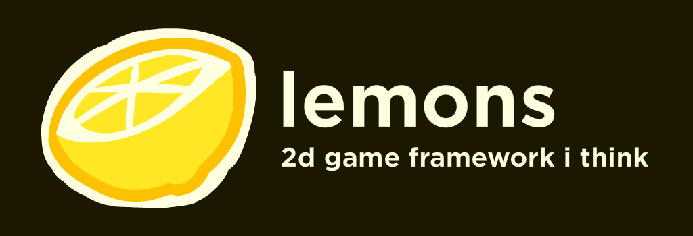

lemons is a game framework that's built on haxe that provides.. well what a game framework should, a framework to build your games on

lemons is split into two parts:
- liblemons [the native code for parts of the framework like sound, video, etc...]
- lemons [the main library that you're going to include in your project]

also if you haven't noticed yet, this library is hevily unfinished as of now, pull requests and issues are greatly appreciated

   
oh, by the way lemons is always spelt lowercase
